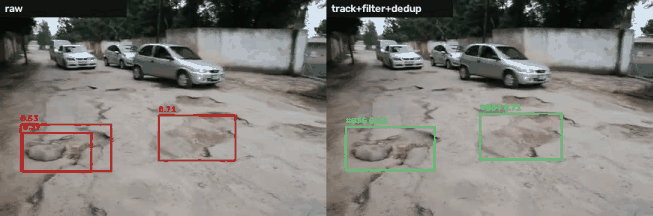
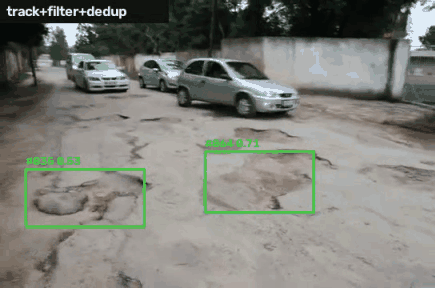

# Pothole detection — YOLOv8 + ByteTrack

[English](README.md) · **Türkçe**

Yol çukurlarını tek sınıf (`pothole`) olarak tespit eden bir YOLOv8n modeli,
videoda kararlı gösterim için ByteTrack tabanlı takip ve modelin neden
~0,72 mAP50'de durduğunu açıklayan deney dizisi.



*Solda her kare bağımsız tahmin ediliyor. Sağda tracking, kalıcılık filtresi
ve çift kutu bastırma var. Video 544×360 çözünürlükte ve eğitimde
kullanılmadı.*

## Özet

| | Sonuç |
| --- | --- |
| Model | YOLOv8n, 640 px, MWPD (reviewed-v1 etiketleri) |
| Validation (249 görüntü, 545 kutu) | P 0,726 · R 0,660 · **mAP50 0,716** · mAP50–95 0,331 |
| Test (97 görüntü, 292 kutu, tek ölçüm) | P 0,763 · R 0,647 · **mAP50 0,715** · mAP50–95 0,353 |
| Hız | 15,1 ms/görüntü (RTX 3050 Laptop, FP32, yalnız model) |
| Video titremesi | Dakikada 532 → **47** kutu kaybolması (tracking + filtre) |

Beş deney (kapasite, mimari, etiket revizyonu, ek veri) ve altı dış model
aynı validation setinde 0,54 ile 0,73 arasında kaldı. Darboğaz model değil,
verinin kendisi. Train bölümündeki 2149 görüntü yalnızca 575 benzersiz
kaynaktan geliyor, çukur sınırları da net etiketlenemiyor. Ayrıntılar aşağıda.

## Deneyler

Tüm sonuçlar MWPD validation bölümünden. "Eğitim val" sütunu eğitim sırasındaki
en iyi epoch'un mAP50 değeri. "`eval.py`" sütunu aynı ağırlığın standart
protokolle ([EVAL_PROTOCOL.md](EVAL_PROTOCOL.md)) yeniden ölçümü. Validation
skoru epoch'tan epoch'a yaklaşık ±0,03 oynuyor.

| Deney | Değişen tek şey | Eğitim val mAP50 | `eval.py` mAP50 |
| --- | --- | ---: | ---: |
| **YOLOv8n baseline** | — | **0,729** | **0,716** |
| YOLOv8s | Model kapasitesi | 0,715 | 0,698 |
| YOLOv8n, v2 etiketler | Etiket revizyonu | 0,727 | — |
| YOLOv8n-P2 | Stride-4 ek detection head | 0,710 (ep48'de durduruldu) | — |
| YOLOv8n, MWPD + HRP4K | +2803 benzersiz sahne (ölçeği eşlenmiş kırpım) | 0,721 | — |

Daha önce denenen ama kalıcı fark yaratmayanlar: 960/1280 çözünürlük, TTA,
NMS ayarı ve SAHI. MWPD görüntüleri zaten 640×640 olduğu için SAHI tek pencereye
düşüyor ve bir şey değiştirmiyor.

### Dış modellerle karşılaştırma

[lukekratz/raspberry-pi-5-hailo-8-pothole-detection-system](https://github.com/lukekratz/raspberry-pi-5-hailo-8-pothole-detection-system)
deposundaki altı hazır ağırlık aynı `eval.py` ayarlarıyla ölçüldü. Her dosyanın
pickle içeriği yüklemeden önce statik olarak tarandı (`tools/scan_pickle.py`).

| Model | mAP50 |
| --- | ---: |
| Bu repo, YOLOv8n baseline | **0,716** |
| YOLOv9t | 0,623 |
| YOLOv10n | 0,589 |
| YOLO11n | 0,581 |
| YOLOv8s* | 0,570 |
| YOLOv9s | 0,562 |
| YOLOv8n* | 0,539 |

\*Bu checkpoint'ler iki sınıflı. İki sınıf tek `pothole` sınıfında
birleştirildi, bu yüzden sonuç sadece fikir verir. Hiçbir dış model baseline'ı
geçmedi, yani tavan bu eğitim tarifine özgü değil.

## Model neden ~0,72'de duruyor?

**1. Kaçırmaların çoğu "düşük güven", "hiç görmeme" değil.** Validation
hataları `inspect_errors.py` ile incelendi (conf 0,25, IoU 0,5): 545 kutudan
171'i kaçırılmış, 210 yanlış alarm var.

- Kaçırmaların %73'ünde model doğru yere kutu koyuyor ama güveni 0,25'in
  altında kalıyor (medyan 0,025). %18'ini hiç görmüyor, %9'unda kutu kayık.
- Elle incelenen kaçırmaların (10 görüntü, ~40 kutu) ~%85'i bariz çukur. Yani sorun etiket
  belirsizliği değil, modelin bu sahneleri yeterince öğrenememesi.
- Yanlış alarmların yaklaşık yarısı model hatası değil. İncelenen 17 yanlış
  alarmın 4'ü etiketlenmemiş gerçek çukur, 4'ü doğru çukura yanlış boyutta
  kutu, 2'si su birikintisi.

**2. Kaçırma her boyutta var.** Sorun küçük nesnelere özgü değil. Aşağıdaki
boyut, kutu kenarının görüntü kenarına oranı:

| Kutu boyutu | <%5 | %5–10 | %10–20 | %20–35 | ≥%35 |
| --- | ---: | ---: | ---: | ---: | ---: |
| Recall | 0,36 | 0,55 | 0,71 | 0,73 | 0,86 |
| Kutu sayısı | 11 | 120 | 183 | 126 | 105 |

Bu yüzden P2 head ve SAHI gibi küçük nesneye odaklanan çözümler fark yaratmadı.

**3. Eğitim verisi göründüğünden küçük.** Train bölümünde 2149 görüntü var.
Roboflow'un augmentasyon kopyaları (~3,7×) ayıklanınca yalnızca **575 benzersiz
kaynak** kalıyor. Validation'da 249 görüntü 197 kaynaktan geliyor. Train ile
kaynak çakışması yok, yani sızıntı yok.

**4. Daha fazla veri bu sorunu çözmedi.** 6003 görüntülük HRP4K veri setinin
(4K, hepsi benzersiz) kırpımları, kutu boyutları MWPD dağılımına uyacak şekilde
hazırlanıp (`make_hrp4k_scaled.py`) eğitime eklendi. Sonuç 0,729'dan 0,721'e
indi. MWPD modeli HRP4K kırpımlarında yalnızca 0,259 mAP50 alıyor. İki veri
seti birbirinden çok farklı (HRP4K çukurları daha sığ ve lekeye benziyor), bu
yüzden eklenen sahneler MWPD'deki performansa yansımıyor.

**5. mAP50–95'in düşüklüğü sınır belirsizliğinden.** Doğru tespitlerin IoU
medyanı 0,74. Sadece %5'i 0,9'un üstünde. Görüntüde çukurun kenarı net değil,
bu yüzden yüksek IoU eşiklerinde etiketleme tutarlılığı sonucu sınırlıyor
([ANNOTATION_POLICY.md](ANNOTATION_POLICY.md)).

## Video demo



`demo_video.py` aynı videoyu iki modda işler:

- **raw:** Her kare bağımsız tahmin edilir, conf 0,25.
- **track:** ByteTrack ([trackers/pothole_bytetrack.yaml](trackers/pothole_bytetrack.yaml))
  ve üç görselleştirme kuralı:
  - *Kalıcılık:* Bir track en az 5 karede görülmeden çizilmez. Böylece tek
    karelik yanlış alarmlar elenir.
  - *Tutma:* Onaylanmış bir track 8 kareye kadar kaybolursa son kutusu ekranda
    kalır (turuncu). Bu, titremeyi azaltır.
  - *Yumuşatma ve çift kutu bastırma:* Kutu koordinatlarına EMA (α 0,5)
    uygulanır. Küçük kutuya göre örtüşmesi 0,6 veya üstü olan kutulardan
    yalnızca biri çizilir.

Etiketsiz, 3,4 dakikalık videodaki sonuçlar (5121 kare):

| Mod | Tespitli kare | Kutu/kare | Titreme (kaybolma/dk) |
| --- | ---: | ---: | ---: |
| raw | %87,4 | 2,55 | 532 |
| track + filtre | %85,9 | 2,63 | 75 |
| track + filtre + çift kutu bastırma | %85,9 | 2,19 | **47** |

Video etiketsiz olduğu için bunlar doğruluk değil, görüntüleme ölçüleri.
Titreme, çizilmiş bir kutunun bir sonraki karede kaybolması demek. Raw modda
kutular ardışık karelerde IoU ≥0,3 ile eşleştirildi. Bastırma yüzünden bir
kutunun ID'si başka bir kutuya devredildiğinde bu titreme sayılmadı.

## Bilinen sınırlamalar

- **Uzak ve küçük çukurlar:** Düşük çözünürlüklü videoda birkaç piksele düşen
  çukurlar neredeyse hiç bulunmuyor.
- **Kadrajı dolduran çok büyük çukurlar:** Eğitim verisinde bunlardan az var.
  Bazen kaçırılıyor ya da parça parça kutulanıyor.
- **Hareket bulanıklığı:** Bulanık karelerde tespit düşüyor.
- **Yanlış alarmlar:** Araba camı, taş, su birikintisi gibi. Tracking tek
  karelik olanları eliyor, uzun süre görünenleri eleyemiyor.
- **Çift kutu bastırma:** Büyük bir çukurun içindeki gerçekten ayrı küçük bir
  çukuru da bastırabilir.
- **Test seti:** Train ile sahne bağımsızlığı ayrıca denetlenmedi. Test sonucu
  yeni bir sahadaki başarı olarak yorumlanmamalı.

## Kullanım

Windows, Python 3.11, CUDA destekli mevcut `venv` ve Ultralytics 8.4.x ile
çalışır. Sanal ortamı yeniden kurmayın. Veriyi ve mevcut `runs/` kayıtlarını
koruyun. Ana veri `data/MWPD_reviewed_v1`, yapılandırması
`data.reviewed-v1.yaml`. `test` bölümü model seçiminde kullanılmaz.
`data/`, `runs/`, `reports/` ve `*.pt` dosyaları repoda yok.

### Kurulum kontrolü

Proje kökünde PowerShell/VS Code terminali açın:

```powershell
& .\venv\Scripts\python.exe -c "import torch, ultralytics; print(torch.__version__, ultralytics.__version__, torch.cuda.is_available())"
```

### Eğitim

Ön kontrol veri yollarını ve etiket sayılarını doğrular, varsa SHA-256 veri
manifestini denetler ve modeli yükler. Eğitimi başlatmaz:

```powershell
& .\venv\Scripts\python.exe .\train.py --config .\experiments\reviewed_v1_baseline.yaml
```

Eğitimi başlatmak için aynı komuta `--start` ekleyin. Çıktı, config adı ve
zaman damgasıyla adlandırılan yeni bir `runs/` klasörüne yazılır. Diğer
deneyler `experiments/` altında: `reviewed_v1_yolov8s.yaml`,
`p2_reviewed_v1.yaml`, `mwpd_hrp4k_scaled.yaml`. P2 tarifi ve bellek denemesi
[P2 deney notunda](experiments/p2_reviewed_v1_plan.md).

### Validation değerlendirmesi

```powershell
& .\venv\Scripts\python.exe .\eval.py --weights .\runs\reviewed-v1-baseline_20260915_223719_077806\weights\best.pt
```

Birden fazla modeli karşılaştırmak için `--weights` tekrar verilir. Varsayılan
veri `data.reviewed-v1.yaml`, bölüm `val`, çözünürlük 640. P/R/mAP Ultralytics
`model.val()` ile hesaplanır. Boyut kovaları ve TP IoU tanısı `conf=0.25` ve
eşleştirme `IoU=0.5` ile hesaplanır. Sonuçlar
`reports/eval_<run>_<zaman>/summary.json` ve `summary.md` dosyalarında.
Son modelin test değerlendirmesi yalnızca `evaluate_reviewed_test.py` ile
yapılır. Önceki SAHI skoru ile `model.val()` skoru arasındaki fark
[EVAL_PROTOCOL.md](EVAL_PROTOCOL.md) dosyasında açıklanıyor.

### Hata analizi

```powershell
& .\venv\Scripts\python.exe .\inspect_errors.py --weights .\runs\<run>\weights\best.pt
```

Kaçırmaları ve yanlış alarmları kategorilere ayırır. İşaretli görüntüleri ve
elle inceleme için `review.csv` dosyasını `reports/errors_<run>_<zaman>/`
altına yazar.

### Video demo

```powershell
& .\venv\Scripts\python.exe .\demo_video.py --weights .\runs\reviewed-v1-baseline_20260915_223719_077806\weights\best.pt --source <video.mp4> --mode track
```

Filtre `--min-hits`, `--hold`, `--alpha` ve `--overlap-thresh` ile ayarlanır.
`--max-frames` kısa deneme çalıştırmaları için. Çıktılar
`reports/video_demo_track_<zaman>/` altında: `compare.mp4`, `track.mp4`,
`summary.md`, `per_frame.csv`.

### Dış checkpoint taraması

```powershell
& .\venv\Scripts\python.exe .\tools\scan_pickle.py <dosya.pt> [--output rapor.json]
```

Bir `.pt` dosyasını yüklemeden önce içindeki pickle referanslarını izin
listesiyle karşılaştırır. Temiz sonuç, dosyanın zararsız olduğunu garanti etmez.

## Dosyalar

| Dosya | Görev |
| --- | --- |
| `train.py`, `experiments/*.yaml` | Config tabanlı eğitim ve ön kontrol |
| `eval.py`, [EVAL_PROTOCOL.md](EVAL_PROTOCOL.md) | Standart validation ölçümü |
| `evaluate_reviewed_test.py` | Tek seferlik test değerlendirmesi |
| `prepare_reviewed_dataset.py`, [ANNOTATION_POLICY.md](ANNOTATION_POLICY.md) | Etiket revizyonu |
| `inspect_errors.py` | Kaçırma ve yanlış alarm analizi |
| `make_hrp4k_scaled.py`, `tile_yolo_dataset.py`, [CROP_PIPELINE.md](CROP_PIPELINE.md) | HRP4K hazırlığı |
| `demo_video.py`, `trackers/` | Video demo ve tracking |
| `tools/scan_pickle.py` | Dış checkpoint güvenlik taraması |
| `assets/` | README GIF'leri |
